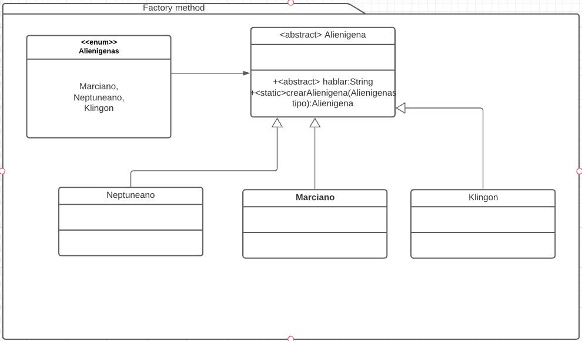

# Factory Method
Es un patron creacional. [Link descripcion](https://sourcemaking.com/design_patterns/factory_method)

En este patrón, se crea un objeto sin exponer la lógica de creación al cliente y se referencia al objeto a través de una interface en común situada en la superclase abstracta de la jerarquia de objetos concreto.

## Diagrama de clases

## SOLID
* Single responsibility

Al crear el metodo factory en la superclase de alienigenas, estamos creando dos razones para cambiar la clase, cuando se implementa un nuevo alienigena, y cuando el Alienigena necesita nuevos métodos por lógica de negocio por lo tanto estariamos rompiendo con este principio.

* Open/Closed principle

Este principio se estaría incumpliendo por la necesidad de modificar el método factoria al crear nuevas implementaciones de Alienigena.

* Liskov Substitution

Cualquier hijo de alienigena se debería comportar como la superclase Alienigena, no hay razón para imcumplir este principio.

* Interface Segregation

La superclase alienigena debería mantenerse mínima e implementar interfaces a medida que se agrega funcionalidad (por ejemplo interfaz volar, telekinesis etc) no hay razón para incumplir este principio.

* Dependency inversión

La superclase alienigena debe conocer sus implementaciones para mantener el método factoria actualizado, este principio no se cumple.
